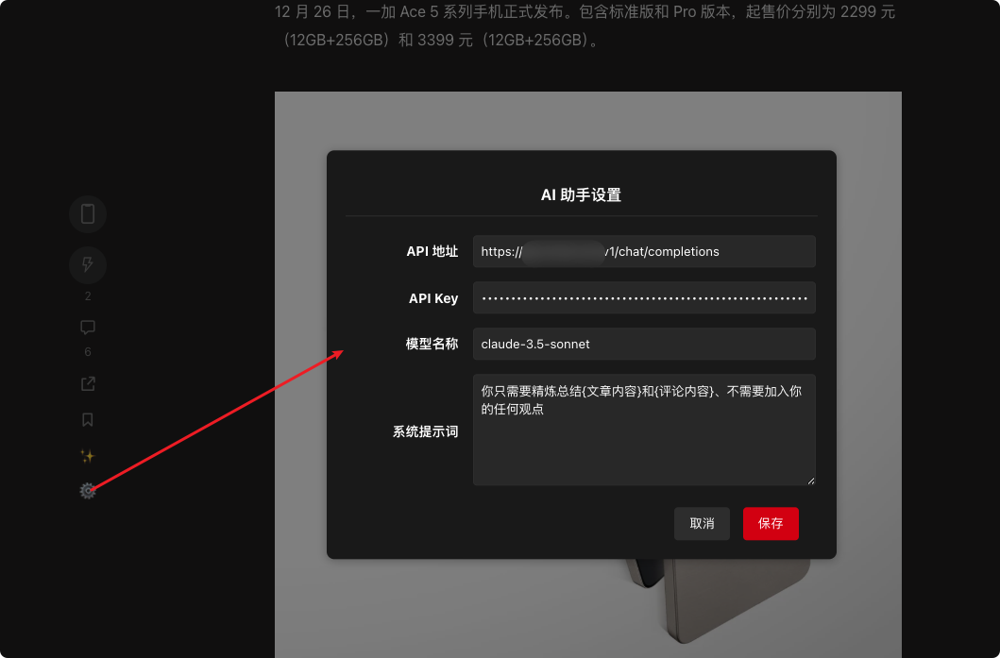
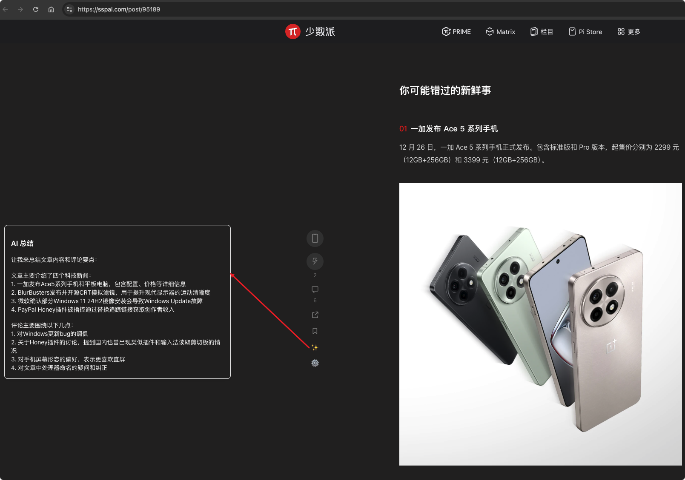

# 少数派 AI 助手 (SSPAI AI Assistant)

一个为少数派文章添加 AI 辅助功能的浏览器扩展，支持一键总结文章内容和评论。

## 主要功能

- ✨ 一键总结文章内容
- 💬 自动获取评论数据
- 🤖 支持自定义 AI 接口
- ⚙️ 可配置的系统提示词
- 🎨 优雅的界面设计

## 源代码
https://github.com/Jandaes/sspai-ai-assistant

## 安装方法

1. 首先安装浏览器扩展 [Tampermonkey](https://www.tampermonkey.net/)
2. 点击下面的安装链接安装脚本：
   [安装脚本](https://greasyfork.org/zh-CN/scripts/521910-%E5%B0%91%E6%95%B0%E6%B4%BE-ai-%E5%8A%A9%E6%89%8B)

## 使用说明

### 基础配置

首次使用需要配置以下内容：

1. 点击文章页面左侧的 ⚙️ 按钮打开设置
2. 填写以下必要信息：
   - API 地址：你的 AI API 接口地址
   - API Key：对应的 API 密钥
   - 模型名称：如 gpt-3.5-turbo（可选）
   - 系统提示词：自定义 AI 总结的风格（可选）

### 使用方法

1. 打开任意少数派文章页面
2. 点击右侧的 ✨ 按钮
3. 等待 AI 生成总结内容
4. 查看生成的文章和评论总结

## 自定义配置

### 系统提示词

你可以自定义系统提示词来控制 AI 总结的风格和内容，默认提示词为：

## 常见问题

1. Q: 为什么点击总结按钮没有反应？
   A: 请检查 API 配置是否正确，确保 API 地址和密钥已正确填写。

2. Q: 如何更新脚本？
   A: 脚本支持自动更新，也可以手动点击 Tampermonkey 中的更新按钮。

## 更新日志

### v0.1.0
- 🎉 首次发布
- ✨ 支持一键总结文章
- 🔧 支持自定义 API 配置
- 💬 支持评论内容总结

## 贡献指南

欢迎提交 Issue 和 Pull Request 来帮助改进这个项目。

## 许可证

MIT License

## 致谢

- [少数派](https://sspai.com/) - 提供优质的内容平台

## 免责声明

本项目仅供学习交流使用，请勿用于商业用途。使用本脚本时请遵守相关法律法规和平台规则。